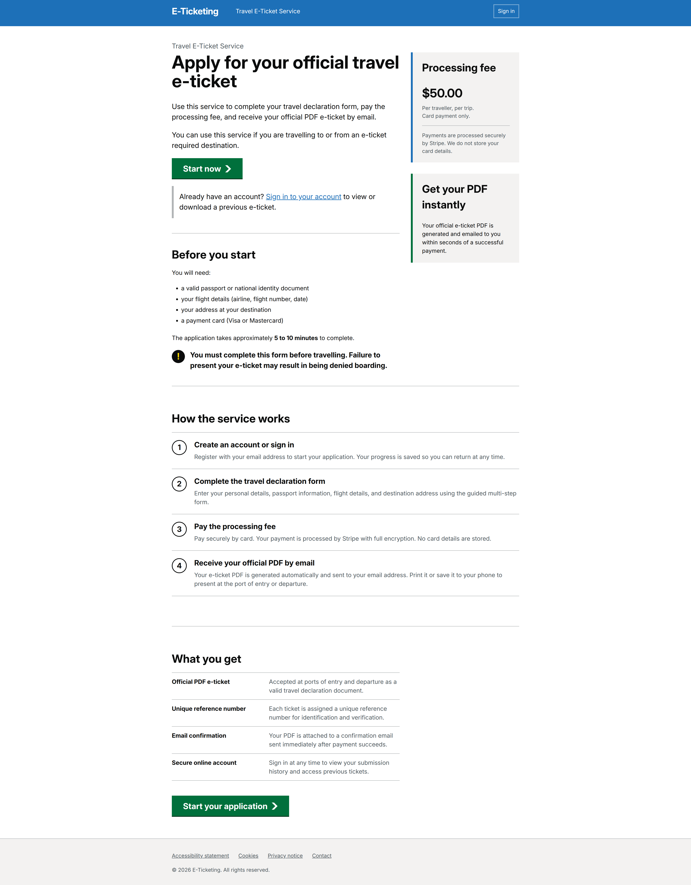
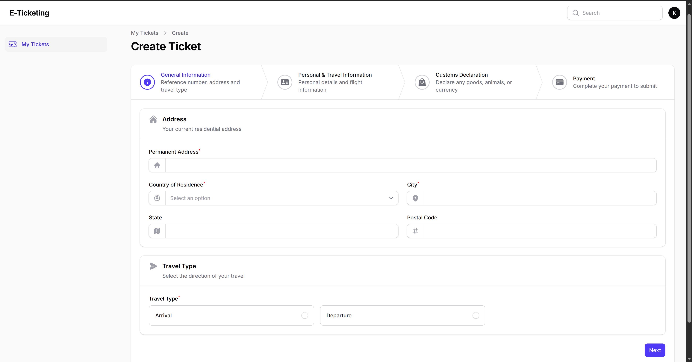
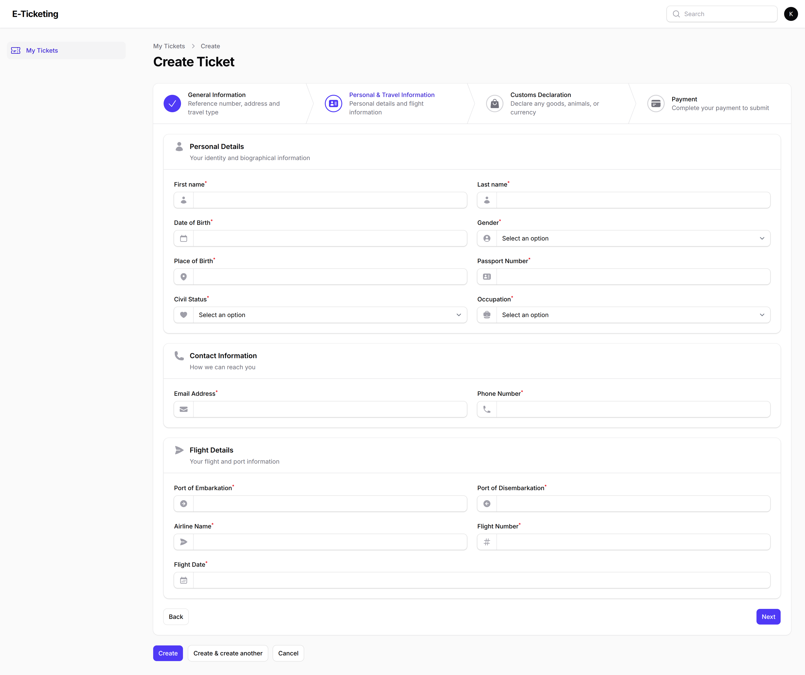
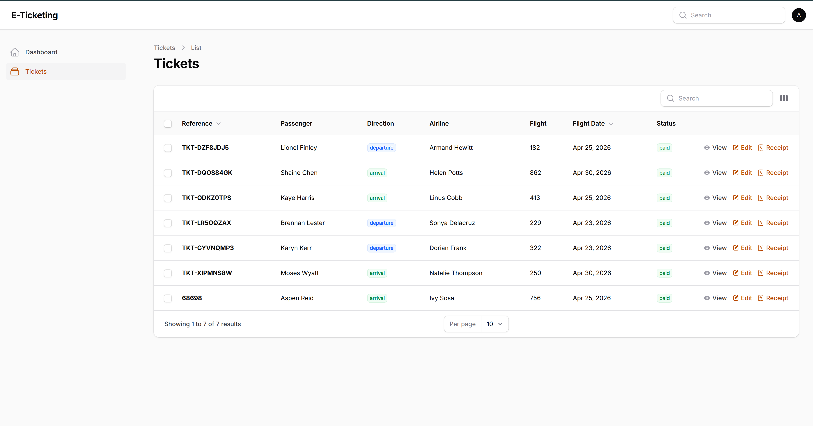

# E-Ticketing Platform

> This project is based on the job description I found on upwork and I found it interesting and decided to implement it myself.

## Job Description

<blockquote>

I'm building a simple web platform where users can complete a travel e-ticket form (similar to Dominican Republic e-ticket sites), pay a fee, and receive a completed PDF via email.

I'm looking for a full stack developer to build the MVP from scratch.

Core Features:
- User-friendly multi-step form (mobile optimized)
- Payment integration (Stripe or similar)
- Auto-generate PDF based on user inputs
- Email delivery of completed document
- Admin dashboard to view/download submissions
- Basic landing page (SEO friendly)

</blockquote>

## What Was Built

### Landing Page

Public-facing page built to GOV.UK design standards. Explains the service, lists what's needed before starting, and links to registration.

---

### User Portal (`/portal`)

Registered users submit tickets through a 4-step wizard:

1. **General Information** — address, country of residence, travel type (arrival/departure)
2. **Personal & Travel Information** — name, DOB, passport, flight details
3. **Customs Declaration** — goods, animals, currency
4. **Payment** — Stripe card payment inline on the form

On submission:
- Payment intent is verified server-side before the record is created
- A unique reference number (`TKT-XXXXXXXX`) is generated
- A PDF e-ticket is generated and emailed to the traveller
- Users can log back in to view their previous submissions

---

### Admin Panel (`/admin`)

Admins can view and search all submitted tickets. The table shows reference, passenger name, direction, airline, flight, date, and payment status. Each row has a link to the Stripe receipt.

Admins cannot create or edit tickets — submissions come from users only.

---

## Tech Stack

- **Laravel 13** — backend framework
- **Filament v5** — admin and user portal panels
- **Livewire v4 + Flux** — frontend components
- **Stripe** (via Laravel Cashier) — payment processing
- **spatie/laravel-pdf** — PDF generation (DomPDF driver)
- **Mailtrap** — email delivery in development
- **SQLite** — database
- **Tailwind CSS v4** — styling
